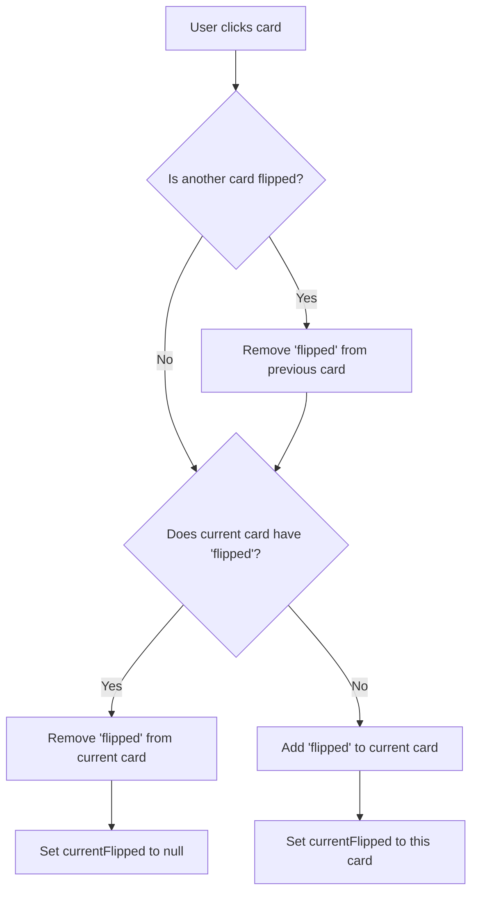

## Overview

The interactive gallery system is a core feature used across the Volunteer Program, Hospital Clown, and Partnerships sections. It implements 3D flip cards that rotate on click to reveal inspirational stories and messages.

## System Architecture

The gallery system consists of three layers:

<Steps>
  <Step title="HTML Structure">
    Semantic markup defining the grid, items, and flip card containers
  </Step>
  
  <Step title="CSS Styling">
    3D transforms, animations, and responsive grid layouts
  </Step>
  
  <Step title="JavaScript Interactions">
    Click handlers to toggle flip states and manage active cards
  </Step>
</Steps>

## HTML Structure

### Gallery Container

The gallery uses a responsive grid layout from `index.html:62-176`:

```html
<section class="galeria-impacto">
    <h2>Historias que Transforman Vidas</h2>
    <p class="galeria-subtitulo">Cada momento cuenta. Cada sonrisa importa.</p>
    
    <div class="galeria-grid">
        <!-- Gallery items go here -->
    </div>
</section>
```

### Flip Card Item Structure

Each gallery item contains a complete flip card:

```html
<div class="galeria-item">
    <div class="galeria-flip-card">
        <!-- Front Face -->
        <div class="galeria-flip-front">
            
            <div class="galeria-overlay">
                <p>Juntos Somos Más Fuertes</p>
            </div>
        </div>
        
        <!-- Back Face -->
        <div class="galeria-flip-back">
            <div class="galeria-historia">
                <p class="historia-titulo">🤝 Comunidad</p>
                <p class="historia-texto">"Un voluntario es fuerte, pero una comunidad de voluntarios es invencible..."</p>
                <p class="historia-autor">— Misión Siloé</p>
            </div>
        </div>
    </div>
</div>
```

### Large Gallery Items

For featured content, add the `galeria-item-grande` class:

```html
<div class="galeria-item galeria-item-grande">
    <!-- Same flip card structure -->
</div>
```

<Note>
On desktop (≥900px), large items span 2 columns and 2 rows. On mobile, they display the same size as regular items.
</Note>

## CSS Implementation

### Grid Layout

The gallery grid from `style.css:1356-1362`:

```css
.galeria-grid {
    display: grid;
    grid-template-columns: repeat(auto-fit, minmax(280px, 1fr));
    gap: 20px;
    max-width: 1400px;
    margin: 0 auto;
}
```

**How it works:**
- `auto-fit`: Creates as many columns as will fit
- `minmax(280px, 1fr)`: Minimum 280px width, grows to fill available space
- `gap: 20px`: 20px spacing between items
- `max-width: 1400px`: Container max width for large screens

### Gallery Item Styling

Base styling for each gallery item from `style.css:1365-1373`:

<CodeGroup>
```css Base Item (style.css:1365-1373)
.galeria-item {
    position: relative;
    overflow: hidden;
    border-radius: 15px;
    aspect-ratio: 1;
    cursor: pointer;
    box-shadow: 0 10px 30px rgba(0, 0, 0, 0.15);
    transition: all 0.4s ease;
}
```

```css Large Item Layout (style.css:1375-1384)
.galeria-item-grande {
    grid-column: span 1;
}

@media (min-width: 900px) {
    .galeria-item-grande {
        grid-column: span 2;
        grid-row: span 2;
    }
}
```

```css Image Scaling (style.css:1386-1395)
.galeria-item img {
    width: 100%;
    height: 100%;
    object-fit: cover;
    transition: transform 0.5s ease;
}

.galeria-item:hover img {
    transform: scale(1.1);
}
```
</CodeGroup>

### Overlay Effect

The overlay appears on hover before clicking from `style.css:1398-1422`:

<Tabs>
  <Tab title="Overlay Structure">
    ```css style.css:1398-1408
    .galeria-overlay {
        position: absolute;
        inset: 0;
        background: linear-gradient(135deg, rgba(41, 171, 226, 0.85), rgba(255, 107, 180, 0.85));
        display: flex;
        align-items: center;
        justify-content: center;
        opacity: 0;
        transition: opacity 0.4s ease;
        padding: 20px;
    }
    ```
  </Tab>
  
  <Tab title="Overlay Hover">
    ```css style.css:1410-1412
    .galeria-item:hover .galeria-overlay {
        opacity: 1;
    }
    ```
  </Tab>
  
  <Tab title="Overlay Text">
    ```css style.css:1414-1422
    .galeria-overlay p {
        color: white;
        font-size: 1.3rem;
        font-weight: bold;
        text-shadow: 2px 2px 4px rgba(0, 0, 0, 0.3);
        text-align: center;
        margin: 0;
        line-height: 1.4;
    }
    ```
  </Tab>
</Tabs>

<Note>
The overlay uses `inset: 0` which is shorthand for `top: 0; right: 0; bottom: 0; left: 0`, positioning it to cover the entire image.
</Note>

## 3D Flip Card CSS

The flip card uses CSS 3D transforms for the rotation effect.

### Flip Card Container

The main flip container from `style.css:1440-1447`:

```css
.galeria-flip-card {
    width: 100%;
    height: 100%;
    position: relative;
    transition: transform 0.6s;
    transform-style: preserve-3d;
    cursor: pointer;
}
```

**Key properties:**
- `transform-style: preserve-3d`: Enables 3D space for child elements
- `transition: transform 0.6s`: Smooth 0.6-second rotation
- `position: relative`: Positions front/back faces absolutely within

### Perspective Setup

Perspective for depth perception from `style.css:1521-1527`:

```css
.galeria-item {
    perspective: 1000px;
}

.galeria-flip-card {
    perspective: 1000px;
}
```

<Warning>
The `perspective` property is crucial for 3D effects. A value of 1000px creates a moderate depth effect. Lower values (e.g., 500px) create more dramatic perspective.
</Warning>

### Flipped State

When the `.flipped` class is added via JavaScript from `style.css:1450-1452`:

```css
.galeria-flip-card.flipped {
    transform: rotateY(180deg);
}
```

This rotates the entire card 180 degrees around the Y-axis (vertical axis).

### Front Face

The front face styling from `style.css:1455-1460`:

```css
.galeria-flip-front {
    width: 100%;
    height: 100%;
    position: absolute;
    backface-visibility: hidden;
}
```

**`backface-visibility: hidden`** is critical - it hides the front face when rotated away from the viewer.

### Back Face

The back face is pre-rotated 180 degrees from `style.css:1463-1476`:

```css
.galeria-flip-back {
    width: 100%;
    height: 100%;
    position: absolute;
    backface-visibility: hidden;
    transform: rotateY(180deg);
    background: linear-gradient(135deg, var(--azul-siloe), var(--rosa-vibrante));
    display: flex;
    align-items: center;
    justify-content: center;
    padding: 20px;
    border-radius: 15px;
    overflow: hidden;
}
```

**How it works:**
1. Initially rotated 180deg (facing away)
2. Hidden due to `backface-visibility: hidden`
3. When card flips 180deg, back face ends up at 0deg (facing viewer)
4. Front face ends up at 180deg (hidden)

### Story Content Styling

The text content on the back face from `style.css:1479-1518`:

<CodeGroup>
```css Container (style.css:1479-1491)
.galeria-historia {
    text-align: center;
    color: white;
    height: 100%;
    display: flex;
    flex-direction: column;
    justify-content: center;
    align-items: center;
    gap: 12px;
    padding: 15px;
    overflow: hidden;
    max-height: 100%;
}
```

```css Title (style.css:1493-1499)
.historia-titulo {
    font-size: 1.2rem;
    font-weight: 700;
    margin: 0;
    text-shadow: 2px 2px 4px rgba(0, 0, 0, 0.3);
    flex-shrink: 0;
}
```

```css Text Content (style.css:1501-1510)
.historia-texto {
    font-size: 0.85rem;
    line-height: 1.4;
    margin: 0;
    font-style: italic;
    text-shadow: 1px 1px 3px rgba(0, 0, 0, 0.2);
    overflow-y: auto;
    flex-grow: 1;
    max-height: 65%;
}
```

```css Author (style.css:1512-1518)
.historia-autor {
    font-size: 0.8rem;
    margin: 0;
    font-weight: bold;
    opacity: 0.9;
    flex-shrink: 0;
}
```
</CodeGroup>

<Note>
The flexbox layout with `flex-grow: 1` on `.historia-texto` allows the main text to expand and become scrollable if needed, while keeping the title and author fixed in size.
</Note>

## JavaScript Implementation

The flip interaction is controlled by JavaScript from `index.html:831-854`:

### Complete Code

```javascript
// Select all flip cards
const flipCards = document.querySelectorAll('.galeria-flip-card');
let currentFlipped = null; // Variable to track currently flipped card

// Add event listener to each card
flipCards.forEach(card => {
    card.addEventListener('click', function() {
        // If there's a card already flipped and it's different from this one
        if (currentFlipped && currentFlipped !== this) {
            // Flip the previous one back
            currentFlipped.classList.remove('flipped');
        }
        
        // Toggle the 'flipped' class on the current card
        this.classList.toggle('flipped');
        
        // Update the reference to the flipped card
        if (this.classList.contains('flipped')) {
            currentFlipped = this;
        } else {
            currentFlipped = null;
        }
    });
});
```

### Code Breakdown

<Steps>
  <Step title="Select all flip cards">
    ```javascript
    const flipCards = document.querySelectorAll('.galeria-flip-card');
    ```
    Gets all elements with class `.galeria-flip-card` across all gallery sections.
  </Step>
  
  <Step title="Track current flipped card">
    ```javascript
    let currentFlipped = null;
    ```
    Stores reference to the currently flipped card to ensure only one is flipped at a time.
  </Step>
  
  <Step title="Add click listeners">
    ```javascript
    flipCards.forEach(card => {
        card.addEventListener('click', function() {
            // Handler logic
        });
    });
    ```
    Attaches click event to each card.
  </Step>
  
  <Step title="Flip back previous card">
    ```javascript
    if (currentFlipped && currentFlipped !== this) {
        currentFlipped.classList.remove('flipped');
    }
    ```
    If another card is flipped, flip it back before flipping the new one.
  </Step>
  
  <Step title="Toggle current card">
    ```javascript
    this.classList.toggle('flipped');
    ```
    Adds `.flipped` class if not present, removes it if present.
  </Step>
  
  <Step title="Update tracker">
    ```javascript
    if (this.classList.contains('flipped')) {
        currentFlipped = this;
    } else {
        currentFlipped = null;
    }
    ```
    Updates the `currentFlipped` reference for the next click.
  </Step>
</Steps>

### Interaction Flow



## Section Toggling

The gallery sections are shown/hidden using a navigation system.

### Navigation Buttons

From `index.html:22-37`, the navigation buttons:

```html
<div class="nav-buttons">
    <button id="btn-nosotros" class="nav-btn nav-btn-active">
        ℹ️ Nosotros
    </button>
    <button id="btn-voluntarios" class="nav-btn">
        👥 Voluntariado Siloé
    </button>
    <button id="btn-clow" class="nav-btn">
        🤡 Clow de Siloé
    </button>
    <button id="btn-aliados" class="nav-btn">
        🤝 Nuestros Aliados
    </button>
</div>
```

### Section Visibility Classes

Sections are toggled using these classes from `style.css:84-102`:

<CodeGroup>
```css Active Section (style.css:85-92)
#seccion-voluntariado.seccion-activa,
#seccion-clow.seccion-activa,
#seccion-aliados.seccion-activa,
#seccion-nosotros.seccion-activa {
    display: block !important;
    opacity: 1 !important;
    visibility: visible !important;
}
```

```css Inactive Section (style.css:95-102)
#seccion-voluntariado.seccion-inactiva,
#seccion-clow.seccion-inactiva,
#seccion-aliados.seccion-inactiva,
#seccion-nosotros.seccion-inactiva {
    display: none !important;
    opacity: 0 !important;
    visibility: hidden !important;
}
```
</CodeGroup>

### JavaScript Section Switching

From `index.html:754-793`, the section switching function:

```javascript
function mostrarSeccion(nombre) {
    console.log('Mostrando sección:', nombre);
    
    // Hide all sections
    seccionVoluntariado.classList.remove('seccion-activa');
    seccionVoluntariado.classList.add('seccion-inactiva');
    seccionClow.classList.remove('seccion-activa');
    seccionClow.classList.add('seccion-inactiva');
    seccionAliados.classList.remove('seccion-activa');
    seccionAliados.classList.add('seccion-inactiva');
    seccionNosotros.classList.remove('seccion-activa');
    seccionNosotros.classList.add('seccion-inactiva');
    
    // Remove active state from all buttons
    btnVoluntarios.classList.remove('nav-btn-active');
    btnClow.classList.remove('nav-btn-active');
    btnAliados.classList.remove('nav-btn-active');
    btnNosotros.classList.remove('nav-btn-active');
    
    // Show selected section
    if (nombre === 'voluntarios') {
        seccionVoluntariado.classList.remove('seccion-inactiva');
        seccionVoluntariado.classList.add('seccion-activa');
        btnVoluntarios.classList.add('nav-btn-active');
    } else if (nombre === 'clow') {
        seccionClow.classList.remove('seccion-inactiva');
        seccionClow.classList.add('seccion-activa');
        btnClow.classList.add('nav-btn-active');
    } else if (nombre === 'aliados') {
        seccionAliados.classList.remove('seccion-inactiva');
        seccionAliados.classList.add('seccion-activa');
        btnAliados.classList.add('nav-btn-active');
    } else if (nombre === 'nosotros') {
        seccionNosotros.classList.remove('seccion-inactiva');
        seccionNosotros.classList.add('seccion-activa');
        btnNosotros.classList.add('nav-btn-active');
    }
    
    // Scroll to top smoothly
    window.scrollTo({ top: 0, behavior: 'smooth' });
}
```

## Gallery Variants

The gallery system has three visual variants:

### Volunteer Gallery

Default styling with blue-pink gradient.

### Clown Gallery

Warm color scheme from `style.css:1424-1431`:

```css
.galeria-clow {
    background: linear-gradient(135deg, #fff4e6, #ffe8cc);
}

.galeria-clow h2 {
    color: var(--rosa-vibrante);
}
```

### Partnership Gallery

Professional blue-purple gradient from `style.css:966-972`:

```css
.galeria-aliados {
    background: linear-gradient(135deg, #e8f4f8, #f0e8f8);
}

.galeria-aliados h2 {
    color: var(--azul-siloe);
}
```

## Adding New Gallery Items

Follow this complete workflow:

<Steps>
  <Step title="Prepare your content">
    Gather:
    - Image file (recommended: 800x800px, JPG or PNG)
    - Overlay title (short, 2-5 words)
    - Story emoji and title
    - Story text (keep under 100 words)
    - Author attribution
  </Step>
  
  <Step title="Upload image">
    Place image in the appropriate folder:
    - Volunteer: `./img voluntario/`
    - Clown: `./img clow/`
    - Partnership: `./img aliados/`
  </Step>
  
  <Step title="Copy template code">
    Use this template:
    ```html
    <div class="galeria-item">
        <div class="galeria-flip-card">
            <div class="galeria-flip-front">
                
                <div class="galeria-overlay">
                    <p>Your Title</p>
                </div>
            </div>
            <div class="galeria-flip-back">
                <div class="galeria-historia">
                    <p class="historia-titulo">🎯 Category</p>
                    <p class="historia-texto">"Your inspiring story..."</p>
                    <p class="historia-autor">— Author</p>
                </div>
            </div>
        </div>
    </div>
    ```
  </Step>
  
  <Step title="Customize content">
    Replace placeholders with your content.
  </Step>
  
  <Step title="Choose size (optional)">
    For featured content, add `galeria-item-grande` class:
    ```html
    <div class="galeria-item galeria-item-grande">
    ```
  </Step>
  
  <Step title="Insert into gallery">
    Add your HTML inside the `.galeria-grid` container in the appropriate section.
  </Step>
  
  <Step title="Test">
    - Image displays correctly
    - Overlay appears on hover
    - Card flips on click
    - Story is readable
    - Only one card flips at a time
  </Step>
</Steps>

## Troubleshooting

<AccordionGroup>
  <Accordion title="Card doesn't flip on click">
    **Possible causes:**
    - Missing `.galeria-flip-card` class on the card container
    - JavaScript not loaded (check browser console for errors)
    - CSS `transform-style: preserve-3d` not applied
    
    **Solution:**
    Verify all classes are present and JavaScript is running after DOM loads.
  </Accordion>
  
  <Accordion title="Back face shows backwards text">
    **Cause:** Missing `backface-visibility: hidden` on front/back faces.
    
    **Solution:**
    Ensure both `.galeria-flip-front` and `.galeria-flip-back` have:
    ```css
    backface-visibility: hidden;
    ```
  </Accordion>
  
  <Accordion title="Multiple cards flip at once">
    **Cause:** JavaScript `currentFlipped` tracking is broken.
    
    **Solution:**
    Verify the click handler logic checks `currentFlipped` before toggling.
  </Accordion>
  
  <Accordion title="Gallery items don't align properly">
    **Cause:** Grid container not properly configured.
    
    **Solution:**
    Ensure parent has `.galeria-grid` class with proper CSS:
    ```css
    display: grid;
    grid-template-columns: repeat(auto-fit, minmax(280px, 1fr));
    ```
  </Accordion>
  
  <Accordion title="Story text overflows card">
    **Cause:** Text content too long for card height.
    
    **Solution:**
    The `.historia-texto` has `overflow-y: auto` to enable scrolling. Keep text under 100 words for best UX.
  </Accordion>
</AccordionGroup>

## Performance Considerations

<CardGroup cols={2}>
  <Card title="Image Optimization" icon="image">
    Compress images to 800x800px or smaller to reduce load time. Use JPG for photos, PNG for graphics with transparency.
  </Card>
  
  <Card title="CSS Transitions" icon="clock">
    The 0.6s transition duration provides smooth animation without feeling sluggish. Avoid durations over 1 second.
  </Card>
  
  <Card title="JavaScript Efficiency" icon="bolt">
    Using `querySelectorAll` once and storing references is more efficient than repeated DOM queries.
  </Card>
  
  <Card title="Mobile Performance" icon="mobile">
    3D transforms are GPU-accelerated on most devices, providing smooth animations even on mobile.
  </Card>
</CardGroup>

## Browser Compatibility

The gallery system uses modern CSS features:

| Feature | Chrome | Firefox | Safari | Edge |
|---------|--------|---------|--------|------|
| CSS Grid | 57+ | 52+ | 10.1+ | 16+ |
| 3D Transforms | 36+ | 16+ | 9+ | 12+ |
| Flexbox | 29+ | 28+ | 9+ | 12+ |
| `backface-visibility` | 36+ | 16+ | 9+ | 12+ |

<Note>
All features are supported in modern browsers (2017+). For legacy browser support, consider adding vendor prefixes using a tool like Autoprefixer.
</Note>
